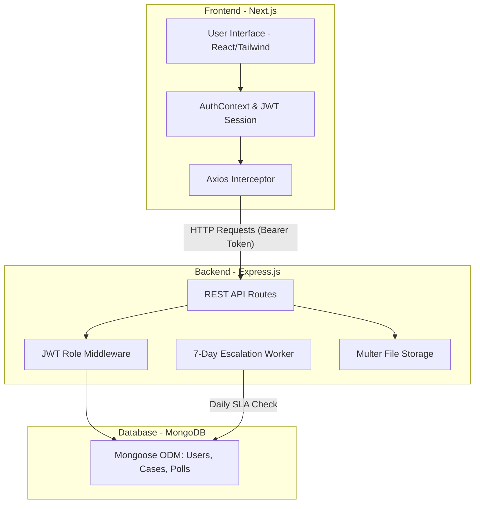

# NeoConnect – Staff Feedback & Complaint Management Platform

An enterprise-grade, full-stack application designed to streamline internal company feedback, enhance policy transparency, and actively track and resolve staff-submitted cases.

---

## 📖 Executive Summary for Project Managers

**NeoConnect** is engineered with a core focus on **transparency, accountability, and metric tracking**. Unlike standard ticketing systems, NeoConnect is built specifically for human resources and organizational management. It empowers staff to submit categorized feedback (optionally anonymously) while providing the Secretariat and Case Managers with a structured, automated pipeline to resolve these cases. 

Additionally, the comprehensive Analytics Dashboard allows stakeholders to instantly monitor organizational health and quickly identify recurring hotspots before they become larger systemic issues.

---

## 🏗 System Architecture

The application follows a modern **Monorepo architecture** utilizing a decoupled Frontend (Next.js) and Backend (Node.js/Express) approach.



### Flow of Data (Example: Submitting a Case)
1. The **Staff Member** submits a form via the `Next.js` interface.
2. The payload is sent via `Axios`, attaching an authorization `JWT token`.
3. The `Express` server receives the request, routing it through an `Authentication` middleware.
4. The backend securely auto-generates a unique `Tracking ID` (e.g., `NEO-2026-042`) and saves the ticket in `MongoDB`.
5. The `Frontend` updates the user's dashboard to reflect the new submission.

---

## 👥 Role-Based Access Control (RBAC)

Security and strict data silos are critical to HR applications. NeoConnect operates on a rigid 4-tier system:

| Role | Access Level & Responsibilities |
| :--- | :--- |
| **Admin (IT)** | Full system access. Can oversee analytics and manage the core user base. |
| **Secretariat** | Triage command center. They oversee all incoming organizational complaints, analyze hotspots, deploy polls, and assign tickets to appropriate Case Managers. |
| **Case Manager** | The resolution team. They are restricted to viewing only the cases specifically assigned to them. They can add progress notes, adjust statuses, and close loops. |
| **Staff** | The standard user base. They can submit feedback, track their own history, cast votes in company-wide polls, and view public quarterly digests. |

---

## 🚀 Key Business Logic & Automated Workflows

### 1. Anonymous Submissions
Staff can safely voice concerns regarding company policy or HR without fear of retaliation. If the "Anonymous" toggle is selected, their name is entirely obscured from the Secretariat and Case Managers, displaying only as "Anonymous" on the tracking dashboards.

### 2. SLA Escalation System (The 7-Day Rule)
To prevent organizational bottlenecks, a background process `(Cron Worker)` runs persistently. It scans the database for any cases categorized as `Assigned` or `In Progress`. If the ticket has not been updated by a Case Manager for **7 calendar days**, the system:
1. Automatically changes the status to **Escalated**.
2. Injects an automated timestamped warning note into the Case History.

### 3. Analytics Hotspot Detection
The Analytics Dashboard features a real-time Recharts visualization suite. It contains a predictive algorithm that scans for dense clustering. **If 5 or more cases originate from the exact same Department and Category** (e.g., *IT Department - Facilities Issues*), a severe red Hotspot Warning is permanently pinned to the Admin/Secretariat layout until the core issue is resolved.

---

## 🛠 Technology Stack

**Frontend:**
*   **Framework:** Next.js (TypeScript)
*   **UI Library:** React.js
*   **Styling:** Tailwind CSS + Minimal Shadcn elements
*   **Charting:** Recharts
*   **Icons:** Lucide-React

**Backend:**
*   **Runtime:** Node.js
*   **Framework:** Express.js
*   **Database:** MongoDB Atlas + Mongoose ODM
*   **Security:** JSON Web Tokens (JWT) & bcrypt Password Hashing
*   **File Uploads:** Multer

---

## ⚙️ Setup & Deployment Guide

### Prerequisites
*   Node.js (v18+)
*   MongoDB Instance (Running locally on `mongodb://localhost:27017` or a remote Atlas connection string)

### 1. Installation
Because this is a Monorepo, the `package.json` at the root will handle installing sub-dependencies simultaneously using `concurrently`.

```bash
git clone https://github.com/ramyegneswar2990/NeoConnect-Staff-Feedback-Complaint-Management.git
cd NeoConnect
npm install
```

### 2. Environment Configuration
Navigate to the `/server` folder and create a `.env` file based on the example.

```bash
cd server
cp .env.example .env
```
Inside `.env`, define your secrets:
```env
PORT=5000
MONGODB_URI=mongodb://127.0.0.1:27017/neoconnect
JWT_SECRET=your_super_secret_jwt_key_here
```

### 3. Seeding the Database (Demo Users)
To populate the database with starting user roles and sample tickets, run the seed script from the root directory:

```bash
npm run seed
```

### 4. Running the Application
From the **root directory**, run:
```bash
npm run dev
```
*   The Backend API will start on `http://localhost:5000`
*   The Frontend Web App will start on `http://localhost:3000`

---

## 🔑 Demo Login Credentials
*(All passwords are: `password123`)*

*   **Admin:** `admin@neoconnect.com`
*   **Secretariat:** `sec@neoconnect.com`
*   **Case Manager:** `manager@neoconnect.com`
*   **Staff:** `staff@neoconnect.com`
