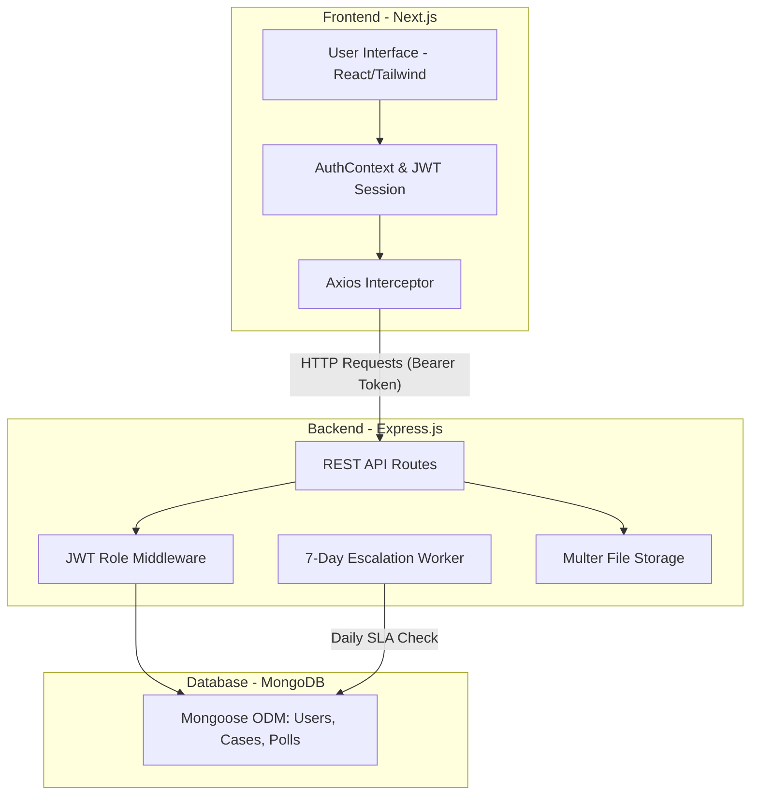

# NeoConnect – Staff Feedback & Complaint Management Platform


An enterprise-grade, full-stack application designed to streamline internal company feedback, enhance policy transparency, and actively track and resolve staff-submitted cases.

---

## 📖 Executive Summary for Project Managers

**NeoConnect** is engineered with a core focus on **transparency, accountability, and metric tracking**. Unlike standard ticketing systems, NeoConnect is built specifically for human resources and organizational management. It empowers staff to submit categorized feedback (optionally anonymously) while providing Secretariat and Case Managers with a structured, automated pipeline to resolve these cases. 

Additionally, comprehensive Analytics Dashboard allows stakeholders to instantly monitor organizational health and quickly identify recurring hotspots before they become larger systemic issues.

---

## 🏗 System Architecture

The application follows a modern **Monorepo architecture** utilizing a decoupled Frontend (Next.js) and Backend (Node.js/Express) approach.



### Flow of Data (Example: Submitting a Case)
1. The **Staff Member** submits a form via `Next.js` interface.
2. The payload is sent via `Axios`, attaching an authorization `JWT token`.
3. The `Express` server receives request, routing it through an `Authentication` middleware.
4. The backend securely auto-generates a unique `Tracking ID` (e.g., `NEO-2026-042`) and saves ticket in `MongoDB`.
5. The `Frontend` updates user's dashboard to reflect the new submission.

---

## 👥 Role-Based Access Control (RBAC)

Security and strict data silos are critical to HR applications. NeoConnect operates on a rigid 4-tier system:

| Role | Access Level & Responsibilities |
| :--- | :--- |
| **Admin (IT)** | Full system access. Can oversee analytics and manage core user base. |
| **Secretariat** | Triage command center. They oversee all incoming organizational complaints, analyze hotspots, deploy polls, and assign tickets to appropriate Case Managers. |
| **Case Manager** | The resolution team. They are restricted to viewing only cases specifically assigned to them. They can add progress notes, adjust statuses, and close loops. |
| **Staff** | The standard user base. They can submit feedback, track their own history, cast votes in company-wide polls, and view public quarterly digests. |

### User Interfaces & Screenshots

#### 👤 Admin Interface
Images/Staff/Screenshot%202026-03-16%20015334.png

*Admin Dashboard Overview*


*Admin User Management & Settings*

**Features:**
- Complete user management with CRUD operations
- System health monitoring and statistics
- Role-based access control
- User activity tracking
- Administrative settings
- High contrast temple night theme for visibility

**Access:** Full system control with user management capabilities

---

#### 👥 Staff Interface  

*Staff Main Dashboard*


*Staff Case History & Tracking*


*Staff Notifications & Updates*

### Submitting a Case

*Frictionless Case Submission Form*

**Features:**
- Submit new cases and complaints
- Track personal case history
- View assigned cases
- Upload attachments
- Receive notifications
- Clean, readable interface with temple night theme

**Access:** Case submission and personal tracking

---

#### 📋 Secretariat Interface

*Secretariat Overview Dashboard*


*Deep-dive Analytics & Insights*


*Secretariat Routing Inbox*


*Case Review & Details View*


*Assigning and Escalating Cases*

**Features:**
- Review and triage incoming cases
- Assign cases to appropriate departments
- Monitor case progress
- Generate reports
- Coordinate between departments
- Analytics dashboard with hotspot detection

**Access:** Case review and assignment capabilities

---

#### 🛠️ Case Manager Interface

*Case Manager Assigned Tickets*


*Updating Case Status & Resolving Issues*


*Adding Internal Notes and Communications*

**Features:**
- Manage assigned cases
- Update case status and notes
- Communicate with submitter
- Resolution management
- Case documentation
- Progress tracking with clear visibility

**Access:** Case resolution and management

---

## 🎨 Temple Night Theme & Design

The application features a sophisticated **temple night theme** designed for maximum readability:

### Theme Features
- **Glassmorphic Presentation**: Frost glass transparency allows background imagery to vibrantly shine through UI elements
- **Scenic Background**: Breathtaking scenic background applied to the `<body>` element on all pages
- **Clear Readability**: Dark translucent overlays with stark white text for ultimate contrast
- **Atmospheric Effects**: Soft frosted borders and translucent shadows that create realistic depth
- **Unified Aesthetic**: Consistent premium glassmorphism applied perfectly to Sidebars, Modals, Forms and Header navigations

### Login Page


The login page maintains a separate **sunset mountain theme** for visual distinction from the main application.

---

## 🚀 Key Business Logic & Automated Workflows

### 1. Anonymous Submissions
Staff can safely voice concerns regarding company policy or HR without fear of retaliation. If "Anonymous" toggle is selected, their name is entirely obscured from Secretariat and Case Managers, displaying only as "Anonymous" on tracking dashboards.

### 2. SLA Escalation System (The 7-Day Rule)
To prevent organizational bottlenecks, a background process `(Cron Worker)` runs persistently. It scans the database for any cases categorized as `Assigned` or `In Progress`. If a ticket has not been updated by a Case Manager for **7 calendar days**, the system:
1. Automatically changes the status to **Escalated**.
2. Injects an automated timestamped warning note into Case History.

### 3. Analytics Hotspot Detection
The Analytics Dashboard features a real-time Recharts visualization suite. It contains a predictive algorithm that scans for dense clustering. **If 5 or more cases originate from the exact same Department and Category** (e.g., *IT Department - Facilities Issues*), a severe red Hotspot Warning is permanently pinned to Admin/Secretariat layout until the core issue is resolved.

---

## 📊 Case Categories

### 🛡️ Safety
- Electrical hazards
- Slip and fall risks
- Equipment safety issues
- Emergency situations

### 📜 Policy
- HR policy questions
- Remote work policies
- Company procedure clarifications
- Compliance issues

### 🏢 Facilities
- Building maintenance
- Equipment repairs
- Lighting and ventilation
- Parking and accessibility

### 👥 HR
- Harassment complaints
- Employee relations
- Benefits questions
- Workplace conflicts

### 📦 Other
- General inquiries
- Suggestions
- Miscellaneous issues

---

## 🛠 Technology Stack

**Frontend:**
*   **Framework:** Next.js (TypeScript)
*   **UI Library:** React.js
*   **Styling:** Tailwind CSS + Minimal Shadcn elements
*   **Charting:** Recharts
*   **Icons:** Lucide-React

**Backend:**
*   **Runtime:** Node.js
*   **Framework:** Express.js
*   **Database:** MongoDB Atlas + Mongoose ODM
*   **Security:** JSON Web Tokens (JWT) & bcrypt Password Hashing
*   **File Uploads:** Multer

---

## ⚙️ Setup & Deployment Guide

### Prerequisites
*   Node.js (v18+)
*   MongoDB Instance (Running locally on `mongodb://localhost:27017` or a remote Atlas connection string)

### 1. Installation
Because this is a Monorepo, the `package.json` at the root will handle installing sub-dependencies simultaneously using `concurrently`.

```bash
git clone https://github.com/ramyegneswar2990/NeoConnect-Staff-Feedback-Complaint-Management.git
cd NeoConnect
npm install
```

### 2. Environment Configuration
Navigate to the `/server` folder and create a `.env` file based on the example.

```bash
cd server
cp .env.example .env
```
Inside `.env`, define your secrets:
```env
PORT=5000
MONGODB_URI=mongodb://127.0.0.1:27017/neoconnect
JWT_SECRET=your_super_secret_jwt_key_here
```

### 3. Seeding the Database (Demo Users)
To populate the database with starting user roles and sample tickets, run the seed script from the root directory:

```bash
npm run seed
```

### 4. Running the Application
From the **root directory**, run:
```bash
npm run dev
```
*   The Backend API will start on `http://localhost:5000`
*   The Frontend Web App will start on `http://localhost:3000`

---

## 🔑 Demo Login Credentials
*(All passwords are: `password123`)*

*   **Admin:** `admin@neoconnect.com`
*   **Secretariat:** `sec@neoconnect.com`
*   **Case Manager:** `manager@neoconnect.com`
*   **Staff:** `staff@neoconnect.com`

---

## 📱 Usage Guide


1. **Login with your credentials** - Access the system with your email and password
2. **Navigate to Dashboard** - Click on "Dashboard" from the sidebar
3. **Click "Submit New Case"** - Located at the top right of your dashboard
4. **Fill in Case Details**:
   - **Title**: Brief summary of the issue
   - **Description**: Detailed explanation of the problem
   - **Category**: Select from Safety, Policy, Facilities, HR, or Other
   - **Department**: Choose the relevant department
   - **Location**: Specify where the issue occurred
   - **Severity**: Choose Low, Medium, or High priority
   - **Anonymous**: Toggle if you want to submit anonymously
5. **Add Attachments** - Upload any relevant documents or images
6. **Submit for Review** - Click the submit button to send to Secretariat

**Form Features:**
- **Real-time Validation**: Instant feedback on required fields
- **Category Guidance**: Descriptions help choose the right category
- **Anonymous Option**: Safe submission without fear of retaliation
- **File Upload**: Support for multiple attachment types
- **Clear Visibility**: High contrast text for easy reading

### Tracking Cases
- **Staff**: View personal case history in dashboard
- **Case Managers**: Monitor assigned cases and update status
- **Secretariat**: Review and assign cases to appropriate teams
- **Admin**: Access comprehensive system overview

### Polls
- **Create Polls**: Admin and authorized users can create polls
- **Participate**: All staff can vote in available polls
- **View Results**: Real-time poll results and analytics

---

## 🔧 API Endpoints

### Authentication
- `POST /api/auth/login` - User login
- `POST /api/auth/register` - User registration

### Cases
- `GET /api/cases` - Get all cases
- `POST /api/cases` - Create new case
- `PUT /api/cases/:id` - Update case
- `DELETE /api/cases/:id` - Delete case

### Admin
- `GET /api/admin/users` - Get all users
- `POST /api/admin/users` - Create user
- `PUT /api/admin/users/:id` - Update user
- `DELETE /api/admin/users/:id` - Delete user
- `GET /api/admin/stats` - Get system statistics

### Polls
- `GET /api/polls` - Get all polls
- `POST /api/polls` - Create poll
- `POST /api/polls/:id/vote` - Submit vote

---

## 🛡️ Security Features

- **JWT Authentication**: Secure token-based authentication
- **Role-Based Access**: Granular permissions by user role
- **Input Validation**: Comprehensive input sanitization
- **CORS Protection**: Cross-origin request security
- **File Upload Security**: Safe file handling and validation

---

## 📈 System Features

### 7-Day Escalation Rule
Cases not updated within 7 days are automatically escalated to ensure timely resolution:
- **Status Check**: Automated monitoring every hour
- **Automatic Escalation**: Cases moved to "Escalated" status
- **Notification System**: Alerts sent to appropriate personnel
- **Audit Trail**: Complete escalation history tracking

### Real-Time Updates
- **Status Changes**: Instant notification of case updates
- **New Assignments**: Immediate alerts for case assignments
- **Resolution Alerts**: Notifications when cases are resolved

---

## 🤝 Contributing

1. Fork the repository
2. Create a feature branch (`git checkout -b feature/AmazingFeature`)
3. Commit your changes (`git commit -m 'Add some AmazingFeature'`)
4. Push to the branch (`git push origin feature/AmazingFeature`)
5. Open a Pull Request

---

## 📞 Support

For support and questions:
- **Email**: support@neoconnect.com
- **Documentation**: Check this README and inline comments
- **Issues**: Report bugs via GitHub Issues

---

## 📄 License

This project is licensed under the MIT License - see the LICENSE file for details.

---

## 🙏 Acknowledgments

- **React Team**: For the amazing React framework
- **Next.js**: For the excellent full-stack framework
- **Tailwind CSS**: For the utility-first CSS framework
- **MongoDB**: For the flexible database solution
- **Lucide Icons**: For the beautiful icon set

---

**NeoConnect** - Connecting Staff, Resolving Issues, Building Better Workplaces 🚀
